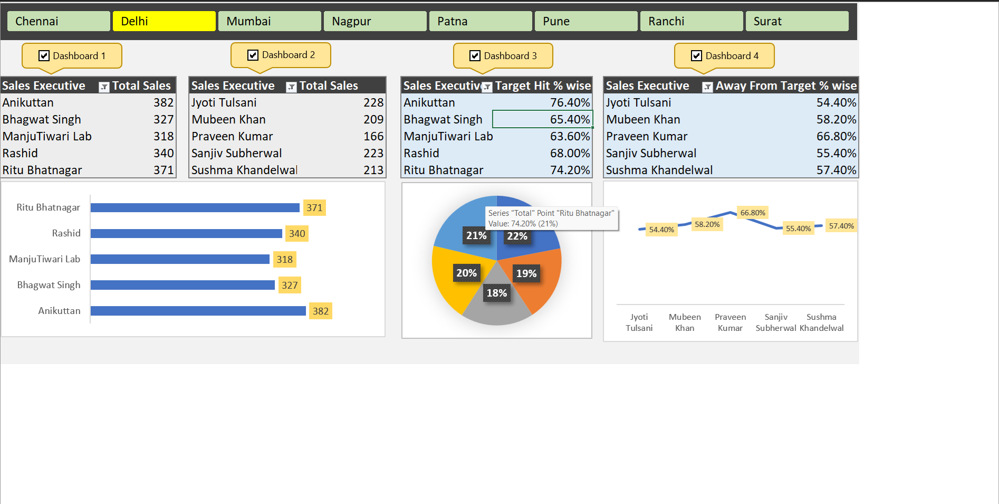

# 📊 Excel Sales Analysis Dashboard

An end-to-end Excel-based Sales Analysis project designed to transform raw data into meaningful business insights using Pivot Tables, Charts, and Dashboard visualization.

---

## 🚀 Project Overview

This project demonstrates the complete data analysis workflow in Microsoft Excel — from raw data handling to creating an interactive dashboard. It helps in understanding sales performance across regions, executives, and targets.

---

## 📌 Key Features

* 📈 **Sales Performance Analysis** (Day-wise & Total Sales)
* 🎯 **Target vs Achievement % Tracking**
* 👨‍💼 **Sales Executive Performance Comparison**
* 🌍 **Region-wise Sales Insights**
* 📊 **Interactive Dashboard using Pivot Tables & Charts**
* 🔄 **Dynamic Data Updates with Pivot Refresh**

---

## 📂 Project Structure

* **Raw Data Sheet**
  Contains original sales dataset including:

  * Sales Executives
  * Region
  * Day-wise Sales (Day 1 – Day 5)
  * Total Sales
  * Targets

* **Dashboard Sheet**
  Built using:

  * Pivot Tables
  * Charts
  * KPIs (Key Performance Indicators)

---

## 🧰 Tools & Skills Used

* Microsoft Excel
* Pivot Tables & Pivot Charts
* Data Cleaning & Structuring
* Dashboard Design
* Basic Data Analysis

---

## 📥 How to Use

1. Download the Excel file from this repository
2. Open in Microsoft Excel
3. Navigate to the **Dashboard Sheet**
4. Use filters (if available) to explore insights
5. Refresh Pivot Tables if needed

---

## 🧠 Key Learnings

* Built an end-to-end data analysis project in Excel
* Gained hands-on experience with Pivot Tables & Dashboards
* Learned how to convert raw data into actionable insights
* Improved data visualization and reporting skills

---

(## 📸 Dashboard Preview)

---

## ✅ Project Status

* ✔️ Completed
* ✔️ Fully Functional Dashboard
* 🔄 Future Improvement: Add slicers & advanced automation (VBA)

---

## 📬 Contact

**Aakash Kumar**
📧 [akashkumar68751@gmail.com](mailto:akashkumar68751@gmail.com)
